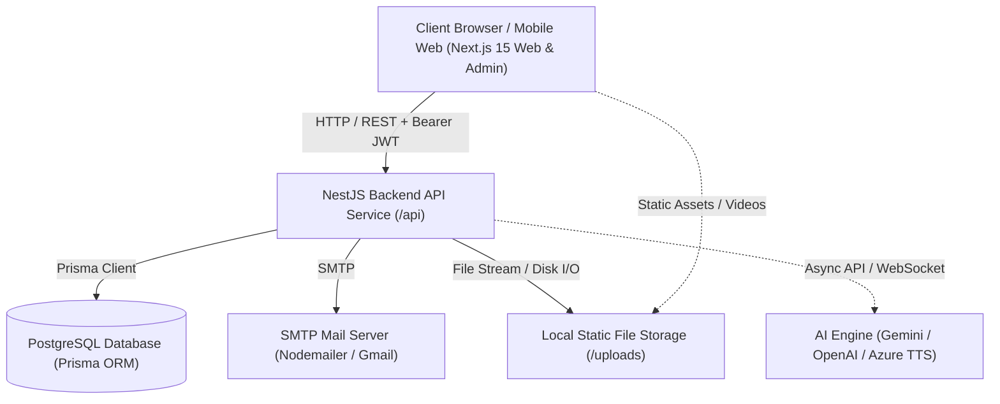

# MinnaUz 2.0 — System Architecture

This document describes the high-level system architecture, service communication, and component breakdown of the **MinnaUz** platform.

---

## 1. System Overview

MinnaUz is structured as a decoupled monorepo consisting of:



---

## 2. Frontend Architecture (`web/`)

The frontend is built using **Next.js 15 (App Router)** with TypeScript and Tailwind CSS.

### Key Architectural Concepts:
1. **Internationalized Routing (`app/[locale]/...`)**:
   - Supported locales: Uzbek (`uz`), Russian (`ru`), English (`en`).
   - Dynamic locale resolution through Next.js middleware and dictionary loaders in `web/lib/i18n`.
2. **Modular Route Segments**:
   - `/[locale]/auth/login` — Passwordless OTP & Google login with animated countdowns and verification steps.
   - `/[locale]/dashboard` — Student home view with daily streak, weekly goal charts, active courses, and personalized banner carousel.
   - `/[locale]/dashboard/courses` — Full JLPT course catalog (N5, N4, N3, N2, N1) with progress badges.
   - `/[locale]/dashboard/courses/[courseId]` — Module and lesson roadmap view.
   - `/[locale]/dashboard/courses/[courseId]/lessons/[lessonId]` — Interactive 5-tab Lesson Studio (Kotoba, Bunpou, Kanji, Renshuu, Kaiwa) with embedded video and completion tracking.
   - `/[locale]/dashboard/notifications` — Notification inbox with read-status, filter tabs, and deep-link banners.
   - `/[locale]/admin` — Admin backoffice portal with user management, course/lesson CMS, banner management, and notification broadcasting.
3. **API Client (`web/lib/api.ts`)**:
   - Centralized Axios/fetch wrapper with automatic `Authorization: Bearer <token>` injection and `x-device-id` header handling.
   - Graceful token expiration handling and device-session synchronization.

---

## 3. Backend Architecture (`api/`)

The backend is built with **NestJS 11**, leveraging modular dependency injection, declarative controllers, Prisma ORM, and comprehensive Swagger documentation.

### Backend Modules Structure:

```text
api/src/
├── app.module.ts              # Root application module orchestrating all feature modules
├── main.ts                    # Application entry point, global pipes, static uploads, Swagger init
├── prisma/                    # PrismaModule & PrismaService wrapper for database access
├── auth/                      # Authentication, OTP generation, Google OAuth, 3-device session manager
│   ├── decorators/            # @CurrentUser(), @Roles()
│   ├── guards/                # JwtAuthGuard, RolesGuard
│   ├── strategies/            # Passport JWT Strategy
│   └── dto/                   # SendOtpDto, VerifyOtpDto, GoogleAuthDto
├── courses/                   # Course catalog, lessons, 5 content tabs, progress tracking, study plans
│   ├── courses.controller.ts  # Student-facing course & progress APIs
│   ├── courses.service.ts     # Business logic for lessons, quiz scoring, and streak calculations
│   └── courses-seed.service.ts# Initial Japanese curriculum seed data (N5 Minna no Nihongo)
├── admin/                     # Admin & Teacher backoffice services
│   ├── admin.controller.ts    # User CRUD, device session revocation, stats
│   ├── admin.service.ts       # User management logic
│   ├── admin-courses.controller.ts # Course, module, lesson, and 4-section content CRUD
│   └── admin-courses.service.ts    # Course CMS business logic
├── notifications/             # System notifications & user read-receipt management
│   ├── notifications.controller.ts
│   └── notifications.service.ts
├── banners/                   # Promotional banner management for dashboard
│   ├── banners.controller.ts
│   └── banners.service.ts
├── upload/                    # File & video upload handler with disk storage and mime validation
│   └── upload.controller.ts
└── mail/                      # Nodemailer service for OTP codes and system alerts
    └── mail.service.ts
```

---

## 4. Database Layer

- **Database Engine**: PostgreSQL 15+.
- **ORM**: Prisma Client.
- **Migration Strategy**: Prisma Migrations (`prisma migrate dev` / `prisma migrate deploy`).
- **Connection Management**: Centralized singleton `PrismaService` extending `PrismaClient` with lifecycle hooks (`onModuleInit`, `onModuleDestroy`).

---

## 5. Authentication & Multi-Device Security

- **Passwordless OTP**: Users request a 6-digit verification code sent via email, valid for 5 minutes.
- **Google OAuth 2.0**: Direct token exchange verifying user identity and email.
- **3-Device Enforcement**: Each user account is allowed at most 3 simultaneous active sessions (`DeviceSession`). When a 4th device authenticates, the oldest active session is automatically revoked or the user is prompted to manage sessions.
- **Role-Based Access Control (RBAC)**: Hierarchy of 4 roles: `USER` → `TEACHER` → `ADMIN` → `SUPER_ADMIN`.

---

## 6. Media & File Handling

- Uploaded videos, audio pronunciations, and image banners are stored in the persistent filesystem under `api/uploads/`.
- Served statically via NestJS `app.useStaticAssets()` on the `/uploads` prefix.
- Supported video formats: MP4, WebM, QuickTime (MOV).
- Maximum video size limit: 500 MB.
- YouTube embed URL parsing supports standard watch URLs, short URLs (`youtu.be`), and direct embed links.

---

## 7. AI & Speaking Infrastructure

- **Kaiwa AI Scenario**: Each lesson schema includes a `kaiwaScenario` JSON configuration with situation descriptions, AI character personas, target vocabulary requirements, and example dialogue trees.
- **Speaking Flow**: Client records audio input $\rightarrow$ STT transcription $\rightarrow$ LLM dialogue evaluation $\rightarrow$ Pronunciation and grammar scoring $\rightarrow$ Neural TTS audio feedback.
