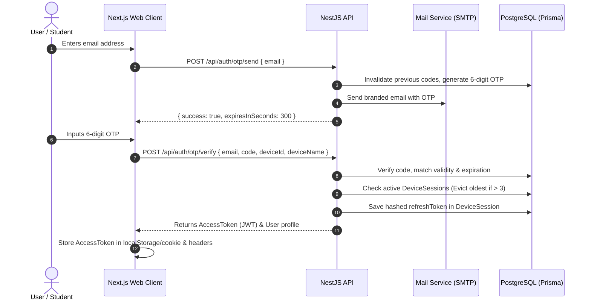

# MinnaUz 2.0 — Authentication & Session Management

This document describes the authentication system, passwordless flow, Google OAuth, session enforcement, and Role-Based Access Control (RBAC).

---

## 1. Authentication Architecture

MinnaUz uses modern **passwordless and multi-device authentication**:



---

## 2. Passwordless Email OTP Flow

1. **Request Code (`POST /api/auth/otp/send`)**:
   - The user inputs their email.
   - The system checks or creates an `OtpCode` record with a random 6-digit numeric token.
   - Any prior unconsumed OTPs for that email are marked `used = true`.
   - The code expires in **5 minutes (300 seconds)**.
   - The code is dispatched via HTML email using Nodemailer.
2. **Verification & Issuance (`POST /api/auth/otp/verify`)**:
   - Compares the provided code against unexpired, unused database entries.
   - On match, sets `used = true` and `User.isVerified = true`.
   - Generates a signed **JWT Access Token**.

---

## 3. Google OAuth 2.0 Flow

1. The frontend authenticates the user using Google OAuth Client SDK.
2. Sends the verified Google ID token and user metadata to `POST /api/auth/google`.
3. The backend matches the email or creates a new `User` with `isVerified = true`.
4. Enforces the 3-device session limit and issues standard JWT tokens.

---

## 4. Multi-Device Management (Maximum 3 Devices)

To prevent unauthorized account sharing while maintaining a seamless user experience across phone, tablet, and desktop:

1. **Unique Device Identifier**:
   - The frontend generates and persists a persistent `deviceId` (UUID v4) in browser `localStorage`.
2. **Session Recording**:
   - Every login registers or updates a `DeviceSession` record storing device metadata (OS, browser, IP, lastActiveAt, hashed refresh token).
3. **Automatic 3-Device Cap**:
   - If a user has 3 active sessions and logs in from a 4th device, the backend automatically revokes the **oldest inactive session** (`lastActiveAt` asc).
4. **Manual Device Revocation**:
   - Users can review their active devices at any time (`GET /api/auth/devices`) and remotely disconnect unwanted sessions (`DELETE /api/auth/devices/:deviceId`).

---

## 5. Role-Based Access Control (RBAC)

MinnaUz defines 4 hierarchical roles:

```text
USER (Student)
  │
  ├── TEACHER (Can create & edit assigned courses, review student progress)
  │     │
  │     └── ADMIN (Full access to users, CMS, banners, notifications)
  │           │
  │           └── SUPER_ADMIN (System-level management)
```

### NestJS Guards & Decorators:
- **`JwtAuthGuard`**: Validates the JWT signature and expiration.
- **`RolesGuard`**: Checks if `@Roles(...)` metadata matches the user's role.
- **`@CurrentUser()`**: Injects the authenticated `User` object into controller route handlers.
