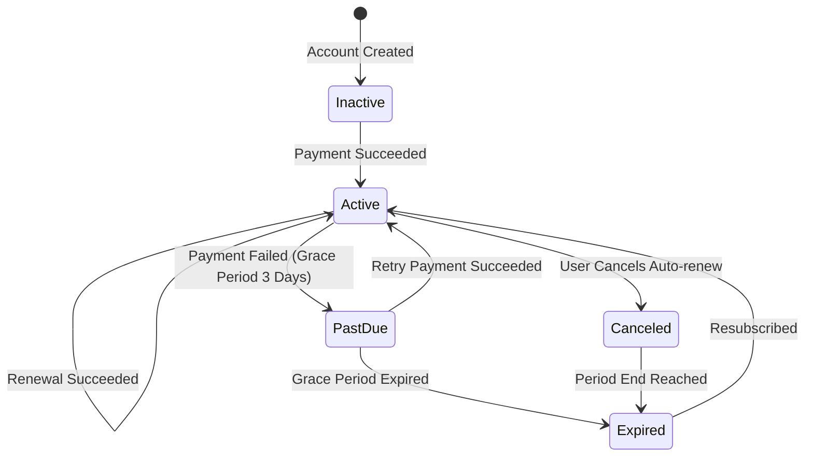

# MinnaUz 2.0 — Subscriptions & Billing

This document outlines the subscription lifecycles, billing frequencies, and planned payment gateway integration architecture.

---

## 1. Subscription Tiers & Billing Frequencies

| Package | Duration | Target Audience | Benefits |
|---|---|---|---|
| **Monthly (Oylik)** | 1 Month | Learners testing the platform | Flexible, cancel anytime |
| **Quarterly (3 Oylik)** | 3 Months | Intermediate learners targeting single JLPT level | 15% discount |
| **Annual (Yillik)** | 12 Months | Serious students targeting N5 to N3 progression | 35% discount + AI bonus tokens |

---

## 2. Subscription Status Lifecycle



### Status Definitions:
- **`ACTIVE`**: User enjoys full Premium Pro benefits.
- **`PAST_DUE`**: Automated card charge failed; a 3-day grace period is granted before feature restriction.
- **`CANCELED`**: Auto-renew disabled; access remains until the current billing cycle expires.
- **`EXPIRED`**: Period ended without renewal; account gracefully downgrades to Free tier.

---

## 3. Payment Gateway Architecture (Uzbekistan & Global)

Payment integration connects national payment providers via webhook listeners:

```text
Student -> Next.js Frontend -> Backend API -> Payment Provider (Payme / Click / Uzum / Stripe)
                                    ^                      |
                                    |--- Webhook Callback -|
```

### Supported Payment Providers:
1. **Payme (Merchant API)** — Card-to-card and QR checkout in UZS.
2. **Click (Click Pass & Merchant)** — Local mobile banking integration.
3. **Uzum Bank / Pay** — Ecosystem integration for Uzbek users.
4. **Stripe / Visa / Mastercard** — International student subscriptions.

---

## 4. Webhook Handling & Idempotency Rules

- **Signature Verification**: Every webhook callback must verify HMAC SHA256 signatures before processing state changes.
- **Idempotency**: Webhook events check for unique transaction IDs to avoid duplicate subscription credit.
- **Receipts**: Automated confirmation notification sent to `UserNotification` inbox and student email upon successful transaction.
