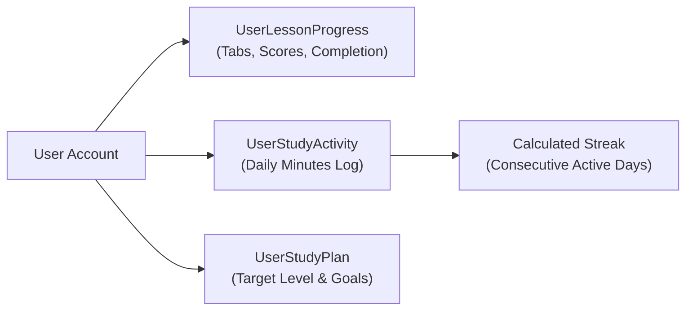

# MinnaUz 2.0 — Users & Learning Profile

This document outlines user models, lifecycle, statistics tracking, and personal study planning.

---

## 1. User Lifecycle & Profile

Each registered entity on MinnaUz is represented by a `User` record with associated learning metadata:

- **Identity**: Email address (unique primary key for login), optional full name, and avatar image.
- **Verification**: Verified status via email OTP or Google OAuth confirmation.
- **Role**: Privilege tier (`USER`, `TEACHER`, `ADMIN`, `SUPER_ADMIN`).

---

## 2. Learning Progress & Statistics

Student progress is tracked across multiple dimensions:

### 2.1 Lesson Progress (`UserLessonProgress`)
- Tracks completed tabs (`kotoba`, `bunpou`, `kanji`, `renshuu`, `kaiwa`).
- Records the highest score obtained in Renshuu practice drills (0-100%).
- Flags overall lesson completion once mandatory sections and tests are passed.

### 2.2 Study Activity & Streak Engine (`UserStudyActivity`)
- Logs active learning time spent on the platform per day.
- Daily streak increments when the student completes at least one study session per calendar day.
- Supports activity heatmap visualization on the student dashboard.

---

## 3. Personalized Study Plan (`UserStudyPlan`)

Students can customize their personal Japanese learning roadmap:

| Attribute | Default | Description |
|---|---|---|
| `targetLevel` | `N5` | Target JLPT exam level (`N5`, `N4`, `N3`, `N2`, `N1`) |
| `weeklyGoalHours` | `4` | Targeted study hours per week |
| `dailyMinutes` | `35` | Recommended daily study session length |
| `targetMonths` | `6` | Target timeline to achieve the selected JLPT level |

---

## 4. Teacher & Classroom Groups

Teachers can organize students into cohorts via `Group` and `GroupMember` models:
- Group invite codes allow students to easily join a teacher's classroom.
- Teachers can track group-wide progress and course milestones.
